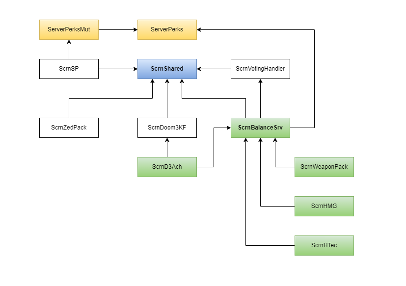

<!-- some link shortcuts -->
[ScrN Brutal KF Bundle]: https://steamcommunity.com/groups/ScrNBalance/discussions/2/483368526570475472/

# KF ScrN Zed Pack

ScrN modification of custom monsters, adjusting game balance and bug fixes.

## Changelog

You can view complete changelog [here](Docs/CHANGELOG.md).

## Features

PLACEHOLDER.

## Building

Requirements:

* [ScrN Shared](https://github.com/poosh/KF-ScrnShared).
* ScrN Zed Packages (included in [ScrN Brutal KF Bundle]):
  * PLACEHOLDER.

**EditPackages**:

```cpp
EditPackages=ScrnShared
EditPackages=ScrNZedPack
```

For other ScrN based packages you can check this dependency diagram.



## Links

* Download [ScrN Brutal KF Bundle].
* Detailed info on the [ScrN Balance News Page](https://steamcommunity.com/groups/ScrNBalance/discussions/2/).
* Any questions about this mod should be posted on [ScrN Balance Steam Group Forums](https://steamcommunity.com/groups/ScrNBalance/discussions/1/). Your feedback is more than welcome!
